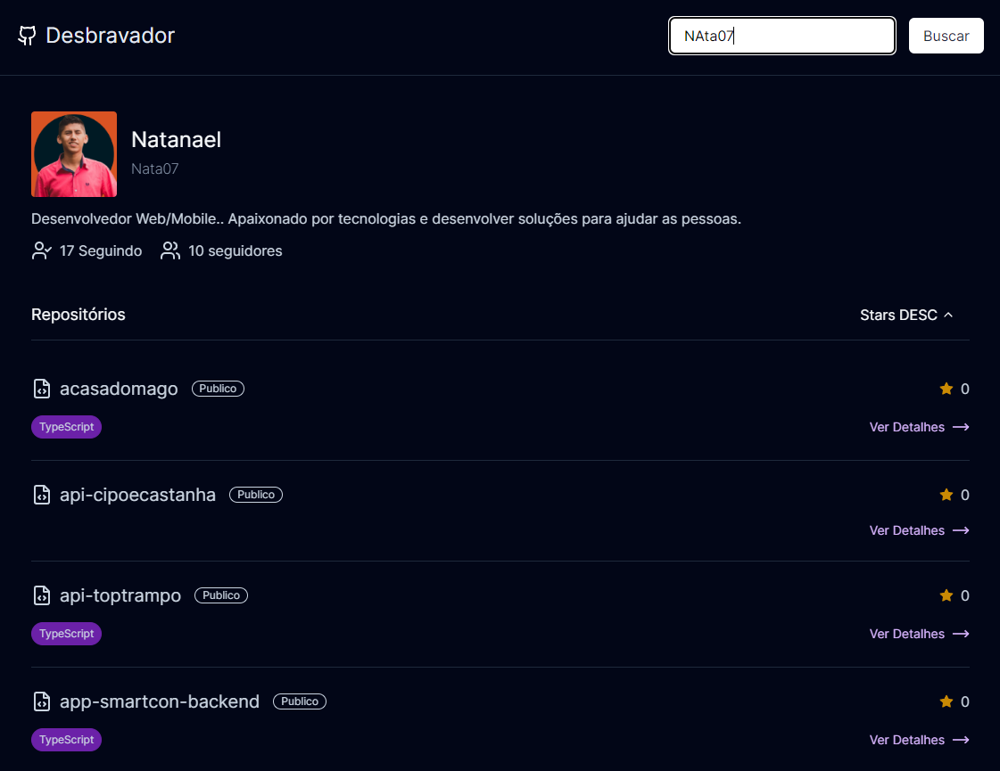

# Projeto de Teste para Desbravador

Pode acessar a aplicação aqui: 
[Acessar Aplicação](https://desafio-desbravador.vercel.app/) 



Este é um projeto de teste criado para a empresa Desbravador. O objetivo deste projeto é demonstrar as habilidades e conhecimentos com desenvolvimento frontend

## Getting Started

Para rodar o projeto, instale as dependências e depois execute o comando:

```bash
npm install
#
npm run dev
# or
yarn dev
# or
pnpm dev
# or
bun dev
```

Abra [http://localhost:3000](http://localhost:3000) no seu navegador.
